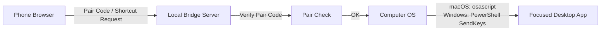

# Hotkey Deck

> A browser-based Stream Deck style macro pad for mobile landscape control.

`Hotkey Deck`은 휴대폰을 가로로 눕혀 하드웨어 매크로 패드처럼 사용하는 웹 기반 단축키 컨트롤러입니다.  
폰에서 버튼을 누르면 같은 네트워크의 Mac 또는 Windows 노트북으로 단축키가 전달됩니다.


## Preview

```text
┌──────────────────────────────────────────────┐
│ Toss CX                 READY    Settings    │
│ ┌──────┐ ┌──────┐ ┌──────┐ ┌──────┐          │
│ │  <[  │ │  >[  │ │  <]  │ │  >]  │          │
│ └──────┘ └──────┘ └──────┘ └──────┘          │
│ ┌──────┐ ┌──────┐ ┌──────┐ ┌──────┐          │
│ │ PLAY │ │ -2ms │ │ +2ms │ │ 확대 │          │
│ └──────┘ └──────┘ └──────┘ └──────┘          │
└──────────────────────────────────────────────┘
```

## Features

- Stream Deck 감성의 브러시 메탈 케이스와 픽셀 스크린 UI
- 모바일 가로 모드 최적화
- Pair Code 인증 전에는 단축키 덱 숨김
- 링크 성공 후 휴대폰 풀 사이즈 덱 사용
- 오른쪽 위 설정 버튼으로만 설정 패널 열기
- 프로필별 단축키 저장
- 키 리코더로 직접 단축키 지정
- 아이콘 선택 및 이미지 업로드
- 더블탭 확대 방지
- macOS / Windows 브리지 서버 지원

## Default Layout

| Row | Button 1 | Button 2 | Button 3 | Button 4 |
| --- | --- | --- | --- | --- |
| 1 | `<[`<br>`Alt + Shift + Q` | `>[`<br>`Alt + Shift + W` | `<]`<br>`Alt + Shift + E` | `>]`<br>`Alt + Shift + R` |
| 2 | `PLAY`<br>`Alt + Shift + S` | `-2ms`<br>`Alt + J` | `+2ms`<br>`Alt + K` | `확대`<br>`Alt + '` |

## Quick Start

### 1. UI만 실행

정적 UI만 확인하려면 `index.html`을 브라우저에서 직접 열 수 있습니다.

검증용 서버가 필요하면:

```sh
python3 -m http.server 4173
```

그 다음 브라우저에서 엽니다.

```text
http://127.0.0.1:4173/index.html
```

### 2. 휴대폰으로 컴퓨터 조작

실제 단축키를 Mac 또는 Windows 노트북으로 보내려면 브리지 서버를 실행합니다.

```sh
node server.js
```

터미널에 다음처럼 표시됩니다.

```text
Hotkey Deck bridge is running.
Pair code: 123456
Open one of these URLs on your phone:
  http://localhost:4173/
  http://192.168.x.x:4173/
```

휴대폰에서 `http://192.168.x.x:4173/` 주소를 열고, 접속 전 팝업에 터미널의 `Pair code`를 입력합니다.  
`Link`가 성공해야 단축키 화면이 열립니다.

## How It Works



## Pairing Model

현재 구현은 가벼운 로컬 브리지 모델입니다.

| 항목 | 현재 방식 |
| --- | --- |
| 컴퓨터 식별 | 같은 Wi-Fi의 LAN IP |
| 초기 인증 | 터미널에 표시된 Pair Code |
| 이후 인증 | 브라우저 LocalStorage에 저장된 Pair Code |
| 단축키 저장 | 휴대폰 브라우저 LocalStorage |
| 입력 대상 | 브리지 서버가 실행 중인 컴퓨터의 현재 포커스 창 |

향후 제품형 구조로 확장한다면 아래 모델이 더 적합합니다.

| 항목 | 권장 확장 방식 |
| --- | --- |
| 노트북 | `host_id` + SQLite |
| 휴대폰 | `remote_id` + LocalStorage |
| 연결 관계 | `pairing_id` + `pairing_secret` |
| 초기 인증 | QR 코드 |
| 이후 인증 | HMAC 서명 또는 토큰 검증 |
| 단축키 저장 | 노트북 SQLite |

## Platform Notes

### macOS

처음 사용할 때는 터미널 또는 Node.js에 아래 권한을 허용해야 합니다.

```text
System Settings > Privacy & Security > Accessibility
```

macOS 키 입력은 `osascript`와 `System Events`를 사용합니다.

### Windows

Windows에서는 아래 조건이 필요합니다.

- Windows 노트북과 휴대폰이 같은 Wi-Fi에 연결
- Windows 방화벽에서 Node.js의 개인 네트워크 접근 허용
- 단축키를 받을 프로그램 창이 현재 포커스된 상태

Windows 키 입력은 PowerShell `System.Windows.Forms.SendKeys`를 사용합니다.

## Project Structure

```text
hotkey/
├─ index.html   # App shell and pairing/settings UI
├─ styles.css   # Stream Deck style responsive design
├─ app.js       # Deck state, profiles, pairing gate, shortcut dispatch
├─ server.js    # Local bridge server for macOS / Windows input
└─ README.md
```

## Development Checklist

```sh
node --check app.js
node --check server.js
```

브리지 서버 실행:

```sh
node server.js
```

다른 포트로 실행:

```sh
PORT=4175 node server.js
```

## Roadmap

- QR 코드 기반 초기 페어링
- SQLite 기반 노트북 저장소
- `host_id`, `remote_id`, `pairing_id` 관리
- HMAC 서명 기반 요청 검증
- 연결된 휴대폰 목록과 연결 해제 UI
- 덱 프리셋 가져오기 / 내보내기
- Windows 실기 테스트 강화

## Important

일반 웹 브라우저는 보안 정책상 다른 데스크톱 앱으로 전역 단축키를 직접 보낼 수 없습니다.  
이 프로젝트의 `server.js`는 같은 네트워크의 휴대폰 요청을 받아 로컬 컴퓨터에서 OS 키 입력을 발생시키는 브리지입니다.
