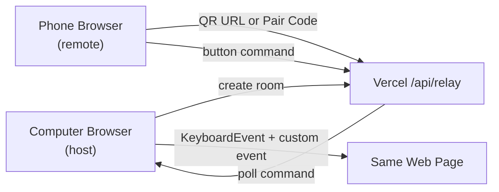

# Hotkey Deck

> A browser-based Stream Deck style macro pad for mobile landscape control.

`Hotkey Deck`은 휴대폰을 가로로 눕혀 하드웨어 매크로 패드처럼 사용하는 웹 기반 단축키 컨트롤러입니다.  
폰에서 버튼을 누르면 컴퓨터에서 열어둔 같은 웹페이지로 단축키 명령이 전달됩니다.


## Preview

```text
┌──────────────────────────────────────────────┐
│ Toss CX                 READY    Settings    │
│ ┌──────┐ ┌──────┐ ┌──────┐ ┌──────┐          │
│ │  <[  │ │  >[  │ │  <]  │ │  >]  │          │
│ └──────┘ └──────┘ └──────┘ └──────┘          │
│ ┌──────┐ ┌──────┐ ┌──────┐ ┌──────┐          │
│ │ PLAY │ │ -2ms │ │ +2ms │ │ 확대 │          │
│ └──────┘ └──────┘ └──────┘ └──────┘          │
└──────────────────────────────────────────────┘
```

## Features

- Stream Deck 감성의 브러시 메탈 케이스와 픽셀 스크린 UI
- 모바일 가로 모드 최적화
- QR 또는 Pair Code 인증 전에는 단축키 덱 숨김
- 링크 성공 후 휴대폰 풀 사이즈 덱 사용
- 오른쪽 위 설정 버튼으로만 설정 패널 열기
- 프로필별 단축키 저장
- 키 리코더로 직접 단축키 지정
- 아이콘 선택 및 이미지 업로드
- 더블탭 확대 방지
- Vercel API 기반 브라우저-브라우저 릴레이

## Default Layout

| Row | Button 1 | Button 2 | Button 3 | Button 4 |
| --- | --- | --- | --- | --- |
| 1 | `<[`<br>`Alt + Shift + Q` | `>[`<br>`Alt + Shift + W` | `<]`<br>`Alt + Shift + E` | `>]`<br>`Alt + Shift + R` |
| 2 | `PLAY`<br>`Alt + Shift + S` | `-2ms`<br>`Alt + J` | `+2ms`<br>`Alt + K` | `확대`<br>`Alt + '` |

## Quick Start

### 1. UI만 실행

정적 UI만 확인하려면 `index.html`을 브라우저에서 직접 열 수 있습니다.

검증용 서버가 필요하면:

```sh
python3 -m http.server 4173
```

그 다음 브라우저에서 엽니다.

```text
http://127.0.0.1:4173/index.html
```

### 2. Vercel / 로컬 릴레이로 휴대폰 연결

컴퓨터와 휴대폰이 같은 링크에 접속합니다.

컴퓨터에서 접속하면 자동으로 `host`가 되고, 설정 화면에 QR 코드와 Pair Code가 표시됩니다.  
휴대폰에서 QR을 스캔하면 자동으로 링크되고, QR을 사용할 수 없으면 Pair Code를 직접 입력할 수 있습니다.

강제로 역할을 지정하고 싶으면 URL에 role을 붙일 수 있습니다.

```text
https://your-app.vercel.app/?role=host
https://your-app.vercel.app/?role=remote
```

폰에서 QR 또는 Pair Code 링크가 성공하면 단축키 덱이 열립니다. 컴퓨터 화면은 새로고침해도 같은 Pair Code와 설정 상태를 유지합니다.

## How It Works



## Pairing Model

현재 구현은 가벼운 로컬 브리지 모델입니다.

| 항목 | 현재 방식 |
| --- | --- |
| 컴퓨터 식별 | Vercel 릴레이 room + Pair Code |
| 초기 인증 | 컴퓨터 화면의 QR 코드 또는 Pair Code |
| 이후 인증 | 브라우저 LocalStorage에 저장된 Pair Code |
| 단축키 저장 | 휴대폰 브라우저 LocalStorage |
| 입력 대상 | 컴퓨터에서 열어둔 같은 웹페이지 |

향후 제품형 구조로 확장한다면 아래 모델이 더 적합합니다.

| 항목 | 권장 확장 방식 |
| --- | --- |
| 노트북 | `host_id` + SQLite |
| 휴대폰 | `remote_id` + LocalStorage |
| 연결 관계 | `pairing_id` + `pairing_secret` |
| 초기 인증 | QR 코드 |
| 이후 인증 | HMAC 서명 또는 토큰 검증 |
| 단축키 저장 | 노트북 SQLite |

## Web-only Mode

이 프로젝트는 현재 웹페이지 안에서만 명령을 처리하는 모드에 맞춰져 있습니다.

- 컴퓨터 브라우저는 `host`로 Pair Code와 QR 코드를 만들고 명령을 수신합니다.
- 휴대폰 브라우저는 `remote`로 QR 링크 또는 Pair Code를 통해 연결하고 버튼 명령을 보냅니다.
- 컴퓨터 브라우저는 수신한 명령을 `KeyboardEvent`와 `hotkey-deck-command` 커스텀 이벤트로 발생시킵니다.

다른 데스크톱 앱에 실제 OS 키 입력을 보내는 기능은 웹 보안 정책상 별도 로컬 브리지가 필요합니다.

## Project Structure

```text
hotkey/
├─ index.html   # App shell and pairing/settings UI
├─ styles.css   # Stream Deck style responsive design
├─ app.js       # Deck state, profiles, pairing gate, shortcut dispatch
├─ api/relay.js # Vercel relay function for host/remote browsers
├─ server.js    # Local dev server and optional native bridge experiments
└─ README.md
```

## Development Checklist

```sh
node --check app.js
node --check server.js
node --check api/relay.js
```

로컬 릴레이 서버 실행:

```sh
node server.js
```

다른 포트로 실행:

```sh
PORT=4175 node server.js
```

## Roadmap

- QR 코드 기반 초기 페어링
- SQLite 기반 노트북 저장소
- `host_id`, `remote_id`, `pairing_id` 관리
- HMAC 서명 기반 요청 검증
- 연결된 휴대폰 목록과 연결 해제 UI
- 덱 프리셋 가져오기 / 내보내기
- 안정적인 외부 저장소 기반 릴레이

## Important

일반 웹 브라우저는 보안 정책상 다른 데스크톱 앱으로 전역 단축키를 직접 보낼 수 없습니다.  
현재 Vercel 릴레이 모드는 컴퓨터에서 열어둔 같은 웹페이지 안으로만 명령을 전달합니다.
